## Okta Origin Example

This example uses a Spring Boot app with Spring Security to tie authentication and authorization to an incoming HTTP
header.

The expectation is that this app is configured to only accept connections from an API Gateway and that the API
Gateway sets the expected header once the user has authenticated.

This example uses the [Kong](https://getkong.org/) API Gateway connected to [Okta](https://okta.com) 
using [OIDC](http://openid.net/specs/openid-connect-core-1_0.html) via the 
[Kong OIDC Plugin](https://github.com/nokia/kong-oidc).

To setup this example on your own, you'll need to do the following:

1. Create an Okta Developer Account
2. Create some users and groups
3. Setup an OIDC Application on Okta
4. Setup additional claims for the default Authorization Server on Okta
4. Deploy this application to [Docker](https://www.docker.com/), which includes the Kong API Gateway and this 
Spring Boot application
5. Configure the Kong API Gateway to connect to the Spring Boot app
6. Configure the Kong API Gateway to authenticate to Okta

### Setup Okta

Head over to [https://developer.okta.com](https://developer.okta.com) and create a free Okta Developer Account.

Finish setting up your account by following the link you receive in your email.

From your Admin Console Dashboard, click `Users` -> `Groups`. Click `Add Group`. Enter `users` in the `Name` field
and click `Add Group`. Repeat adding a group, only this time, name the group `admins`.

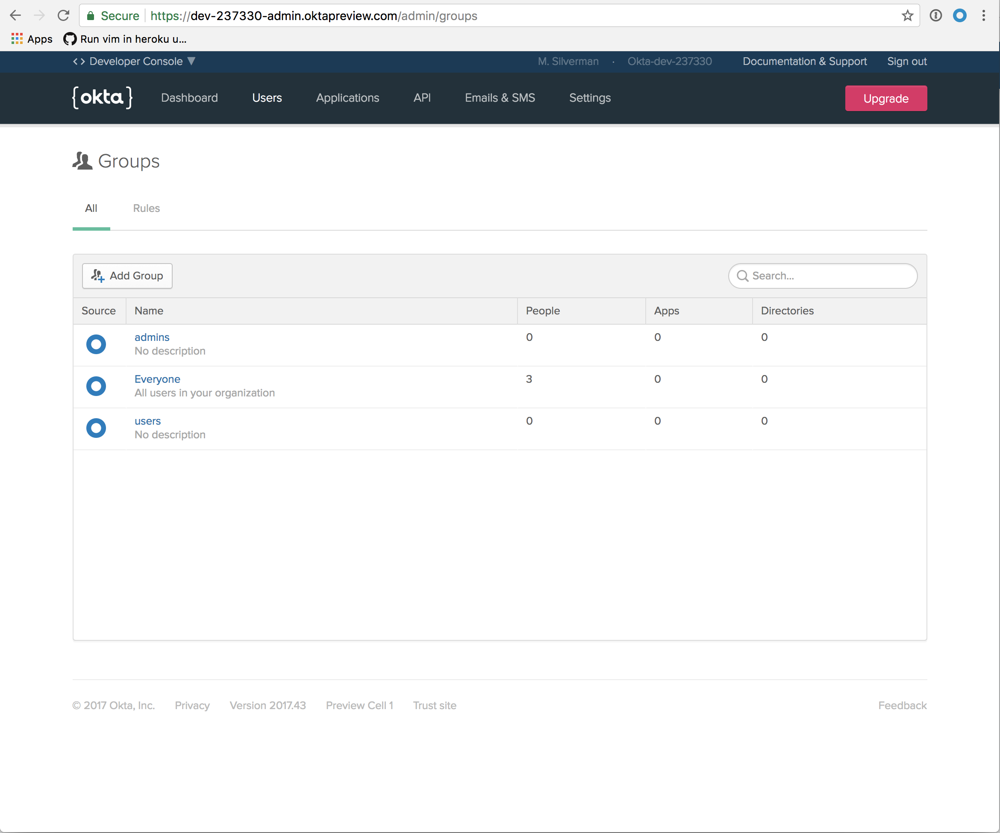

Click `Users` -> `People`. Click `Add Person`.

Fill out the form and put `users` in the `Groups` field. It's important that either the `Primary email` or 
`Secondary email` be a real email address.

Make sure `Send user activation email now` is checked. Click `Save and Add Another`

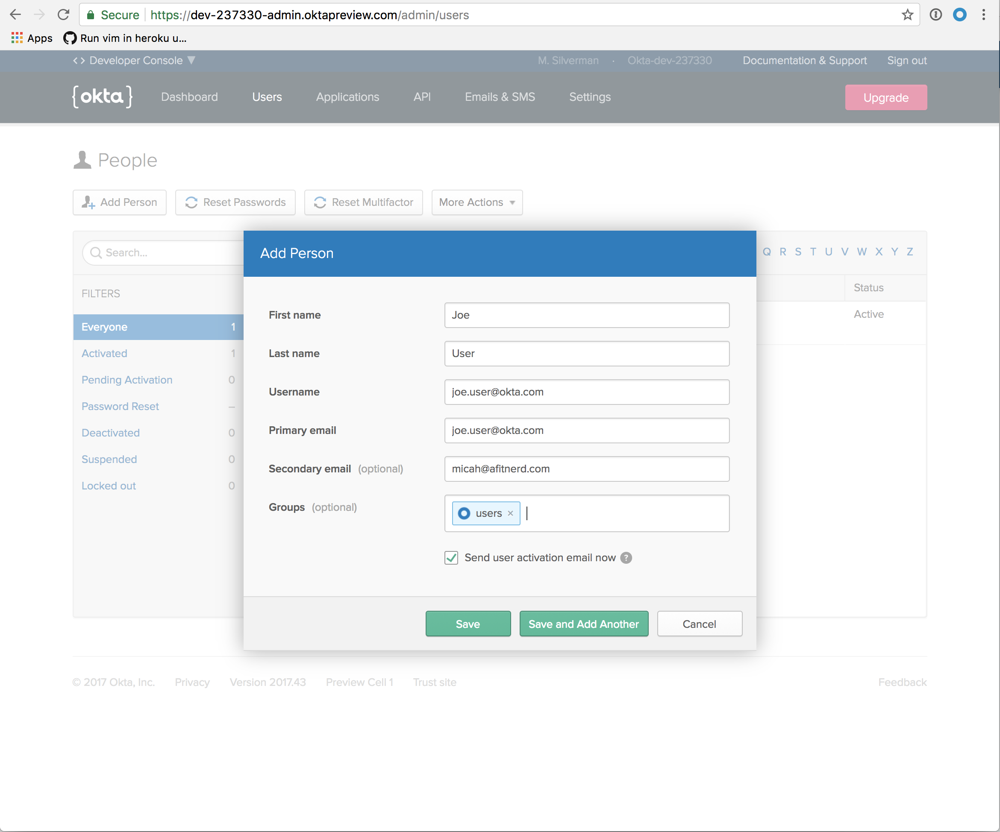

Repeat the process, only this time, put `users` and `admins` in the `Groups` field.

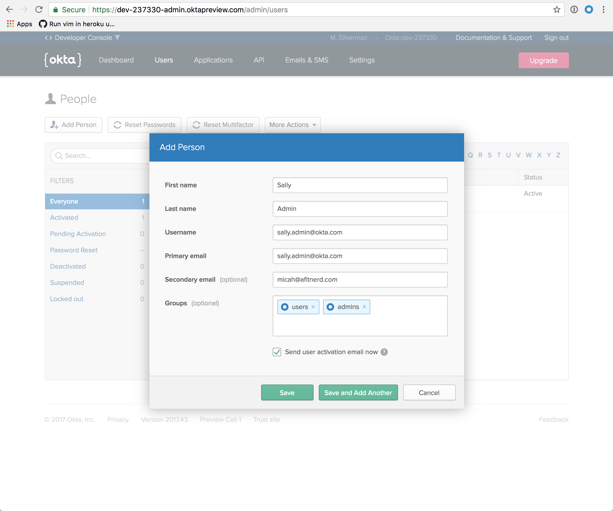

You should receive a confirmation email for each of the users. Make sure you follow the link in each email to finish
setting up these users.

From your Admin Console Dashboard, click `Applications`. Then, click `Add Application`.

Click `Web` and click `Next`.

Fill out the form like so:

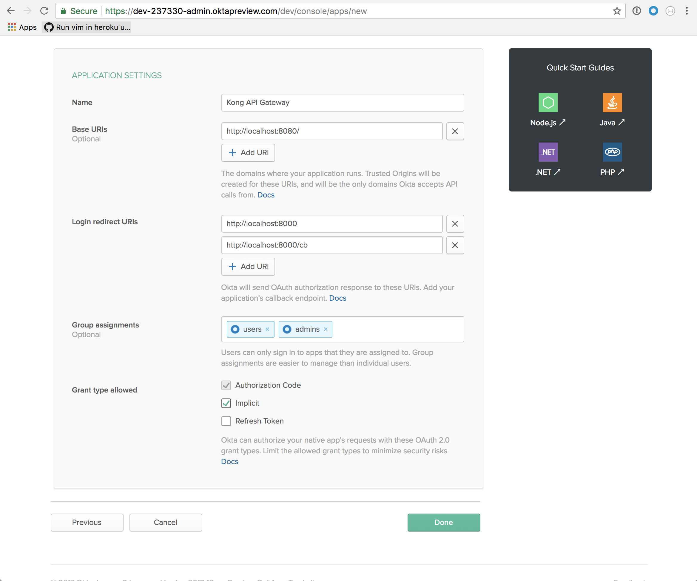

The important things here are:

* Enter `http://localhost:8000/cb` as `Login redirect URIs`
* Enter `users` and `admins` in the `Group assignments` field

Click `Done`

On the `General` tab, scroll down and make note of the `Client ID` and the `Client secret`. You will need them later
when you configure the Kong oidc plugin.

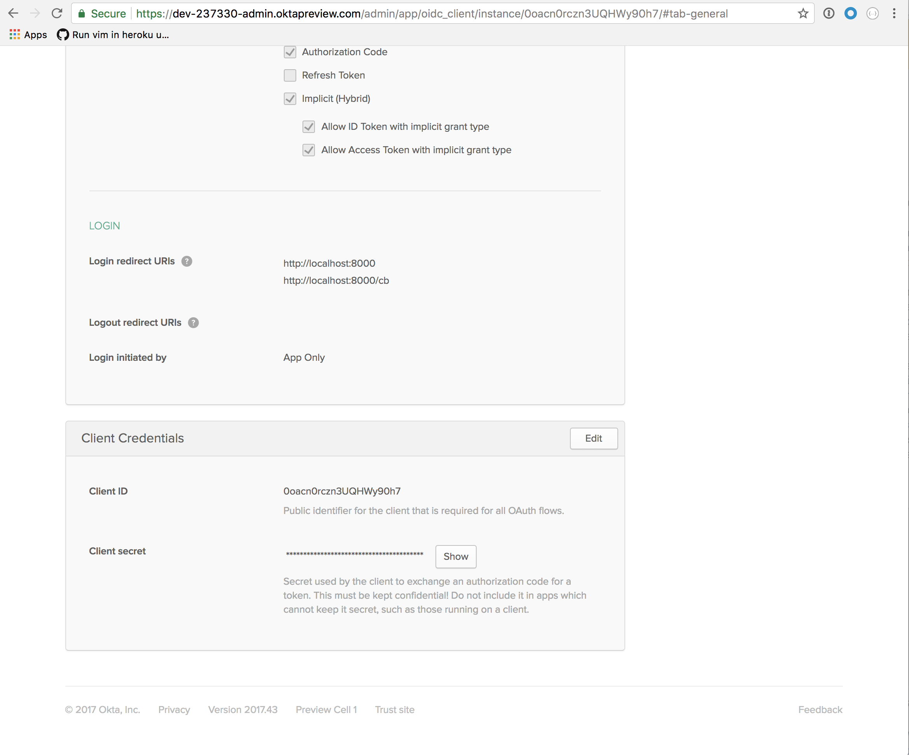

Click `API` -> `Authorization Servers`. Click `default`

Click `Claims`

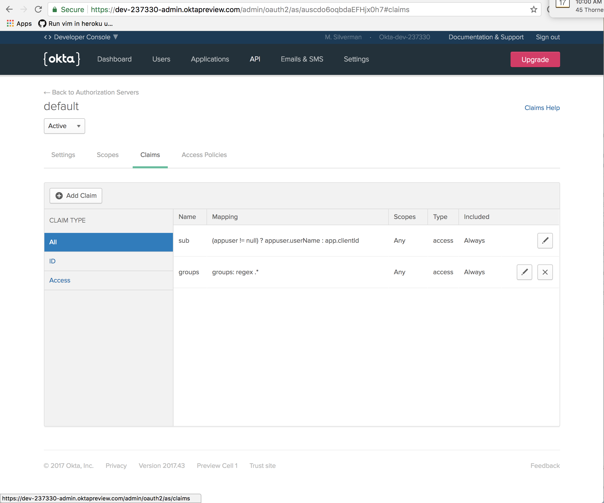

Click the pencil to the right of the `Groups` claim. This is the edit button. Select `ID Token` from the 
`Include in token type` dropdown and click `Save`.

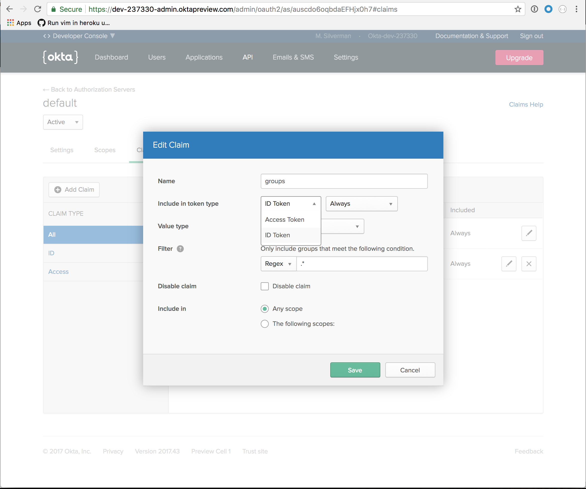

Click `Add Claim`. Fill in the form as follows:


Click `Create`

Click `Add Claim`. Fill in the form as follows:

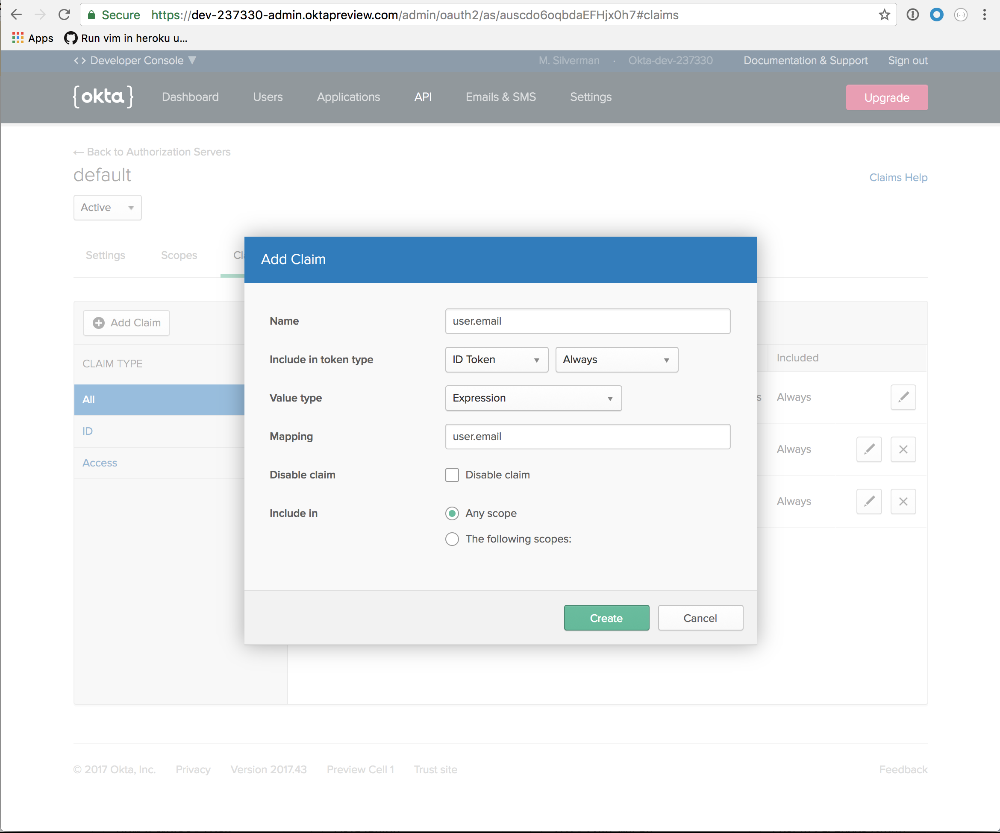

Click `Create`

You should now see the Claims tab like so:


The Kong oidc plugin creates an `X-Userinfo` header based on the information found in the ID Token. The Spring Boot
app looks for this header and builds the granted authorities list from the list of `groups`. It also expects a
`user.fullName` and `user.email` to be in the header.


### Setup Docker

Setup Docker on your local machine by clicking `Get Docker` on [https://www.docker.com/](https://www.docker.com/).

All the screenshots below are on Mac.

There are two Docker images associated with this project. One is for the Kong API Gateway with the OIDC plugin. The
other is the Spring Boot app that Kong will proxy to once the user has authenticated.

We'll build the images and then run them in Docker containers.

First, the Spring Boot app Docker image:

```
mvn clean install
docker build -t header-origin-example .
```

Then, the Kong API Gateway Docker image:

```
cd docker/okta-kong-oidc
docker build -t okta-kong-oidc .
```

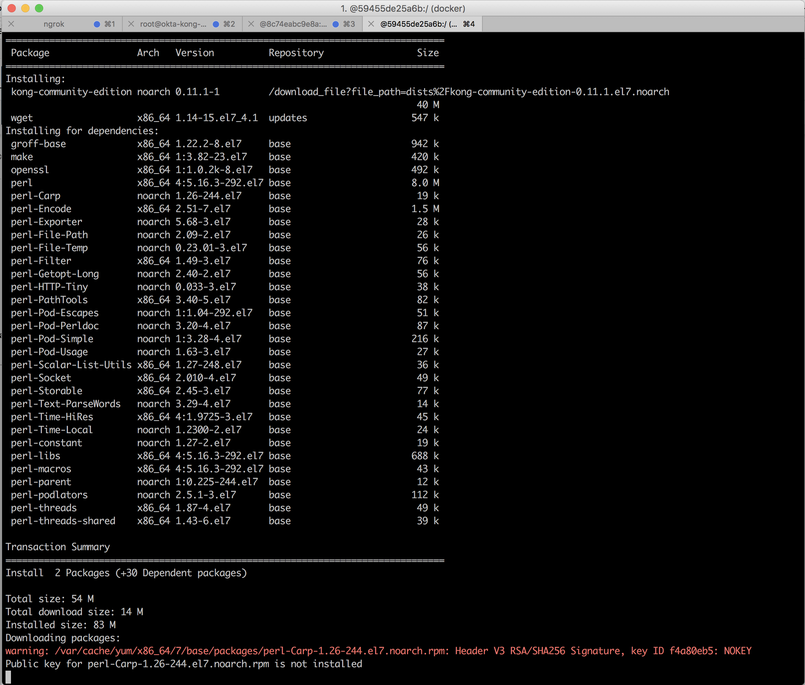

Grab a cup of coffee...

When the images are created, we'll next create a private Docker network for all our containers to use:

```
docker network create okta-kong-bridge
```

**NOTE**: If you've gone through these steps previously, you can remove the network and start over with: 
`docker network rm okta-kong-bridge`

Containers using this network will be able to communicate with each other, but can block connections from outside 
networks.

Now, we'll create the containers:

```
docker run -d --name kong-database \
    --net okta-kong-bridge \
    cassandra:3
```

This sets up a [Cassandra](http://cassandra.apache.org/) database for Kong to use.

```
docker run --rm \
    --net okta-kong-bridge \
    -e "KONG_DATABASE=cassandra" \
    -e "KONG_CASSANDRA_CONTACT_POINTS=kong-database" \
    okta-kong-oidc:latest kong migrations bootstrap
```

This prepares the cassandra database with the latest migrations for use with Kong.

Now that you've created all the images and infrastructure, it's time to run containers using the images. In the
commands below, the containers are run in an interactive mode. That is, the container will be running, but you are not
returned to the command line. You can use separate terminal tabs windows for each command.

```
docker run --rm -it --name okta-kong-oidc \
    --net okta-kong-bridge \
    -e "KONG_LOG_LEVEL=debug" \
    -e "KONG_PLUGINS=oidc" \
    -e "KONG_DATABASE=cassandra" \
    -e "KONG_CASSANDRA_CONTACT_POINTS=kong-database" \
    -e "KONG_PROXY_ACCESS_LOG=/tmp/proxy_access.log" \
    -e "KONG_ADMIN_ACCESS_LOG=/tmp/admin_access.log" \
    -e "KONG_PROXY_ERROR_LOG=/tmp/proxy_error.log" \
    -e "KONG_ADMIN_ERROR_LOG=/tmp/admin_error.log" \
    -p 8000:8000 \
    -p 8001:8001 \
    okta-kong-oidc:latest
```

This creates a container using the `okta-kong-oidc` image we created above. 
Let's look a little more closely at what's going on here.

* On the second line, we reference the network we created. This allows this container to connect to other containers on 
the same network.
* On the fourth line, we set an environment variable to tell Kong to use the oidc plugin
* The last line references the image we created above

```
docker run --rm -it --name header-origin-example \
    --net okta-kong-bridge \
    header-origin-example:latest
```

This creates a container using the `header-origin-example` image we created above.

Notice that we are not exposing any ports to the host. This ensures that *only* containers on the `okta-kong-bridge`
can connect to the Spring Boot app. This is important in gateway-backed applications. You don't want someone
connecting directly to the application that sits behind the Gateway. 

At this point, there should be three Docker containers running: `kong-database`, `okta-kong-oidc`, and 
`header-origin-example`.

We can confirm this by running:

```
docker container ls
```

You should see something like this:

```
CONTAINER ID        IMAGE                          COMMAND                  CREATED             STATUS              PORTS                                                                NAMES
5fd2c1715554        header-origin-example:latest   "/docker-entrypoin..."   14 minutes ago      Up 14 minutes                                                                            header-origin-example
1eea39a21ec7        okta-kong-oidc:latest          "/docker-entrypoin..."   14 minutes ago      Up 14 minutes       0.0.0.0:8000-8001->8000-8001/tcp, 0.0.0.0:8443-8444->8443-8444/tcp   okta-kong-oidc
bf8b41319903        cassandra:3                    "/docker-entrypoin..."   14 minutes ago      Up 14 minutes       7000-7001/tcp, 7199/tcp, 9042/tcp, 9160/tcp                          kong-database
```

### Configure Kong

Now that our docker container is running, we need to wire up the Kong API Gateway to our Spring Boot application and to
Okta for authentication.

The examples below use [HTTPie](https://httpie.org) - a modern curl replacement as well as
[jq](https://stedolan.github.io/jq/) - a fast json parser

First, connect to the kong container:

```
docker exec -it okta-kong-oidc /bin/bash
```

Next, setup routes so when a user connects to the gateway from the outside, it can direct the traffic to an inner
service.

```
SERVICE_ID=`http -f :8001/services url=http://header-origin-example:8080 name=okta-secure | jq -r .id`
http -f :8001/services/${SERVICE_ID}/routes paths=/
```

This command uses Kong's Admin API, which runs on port `8001` by default. Notice how the `url` is connecting
to the Spring Boot app which runs on port `8080` (within its container). Docker networking allows us to reference
the name of one container from another - as long as they're all on the same network.

The json response from the call to the `/services` endpoint is piped to `jq` and the service id is extracted. The
result is assigned to the `SERVICE_ID` environment variable which is then used in the following command to link
routes to the service

```
http -f :8001/plugins \
    name=oidc \
    config.client_id=<client id> \
    config.client_secret=<client secret> \
    config.discovery=<okta base url>/oauth2/default/.well-known/openid-configuration
``` 

This command configures the Kong OIDC plugin to connect to the Okta OIDC application you set up earlier. Here's where
you'll need the `client_id`, `client_secret` and your Okta base url (`https://dev-xxxx.okta.com`)

### Action!

If all has gone well to this point, you have a Docker container running the Kong API Gateway and another running the 
Spring Boot application. Further, Kong is configured with the oidc plugin connected to Okta and to proxy requests to 
the Spring Boot app once you've authenticated. The Spring Boot app is *not* accessible directly from your host 
machine, but only from within the Docker container by Kong.

Browse to: `http://localhost:8000`

You should immediately be redirected to the Okta login screen.

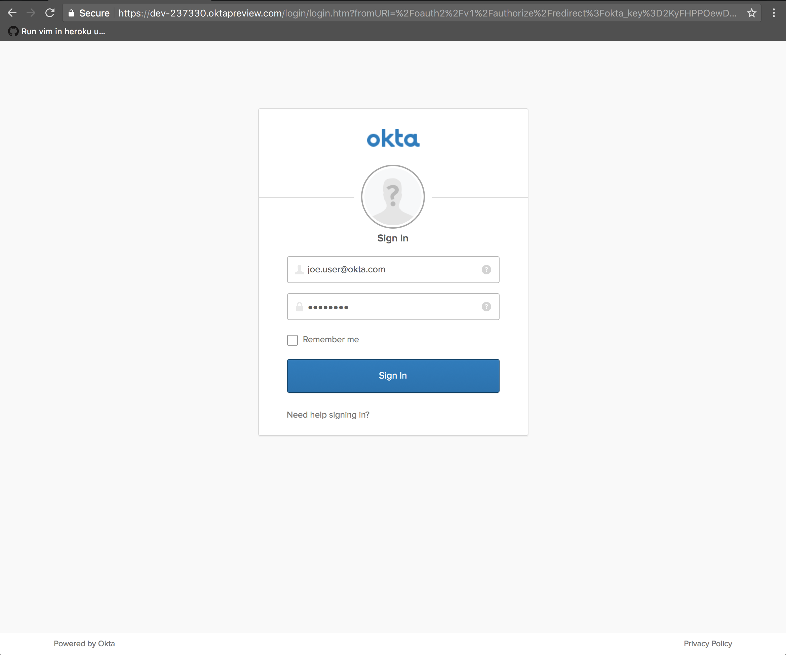

Log in as the user you created that belongs to the `users` group.

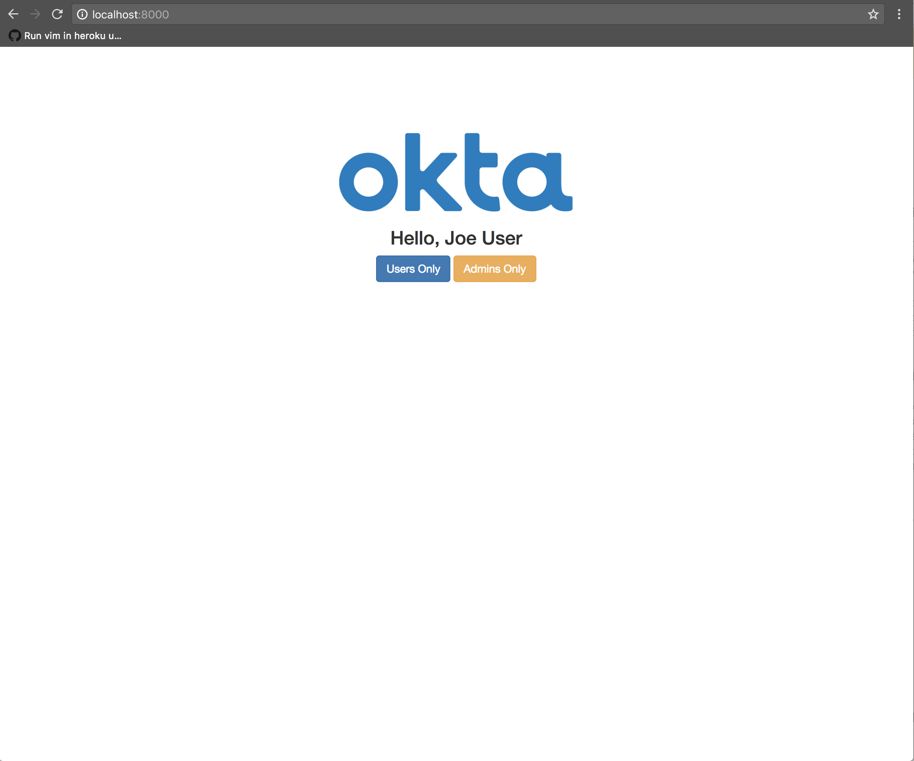

Click `Users Only`

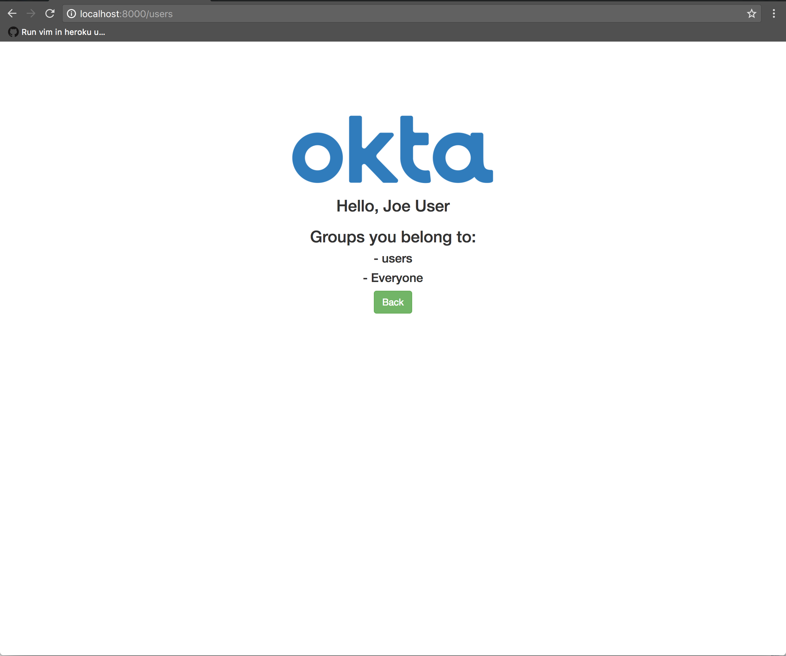

You should see a screen showing the groups you belong to.

Click `Back` and then click `Admins Only`

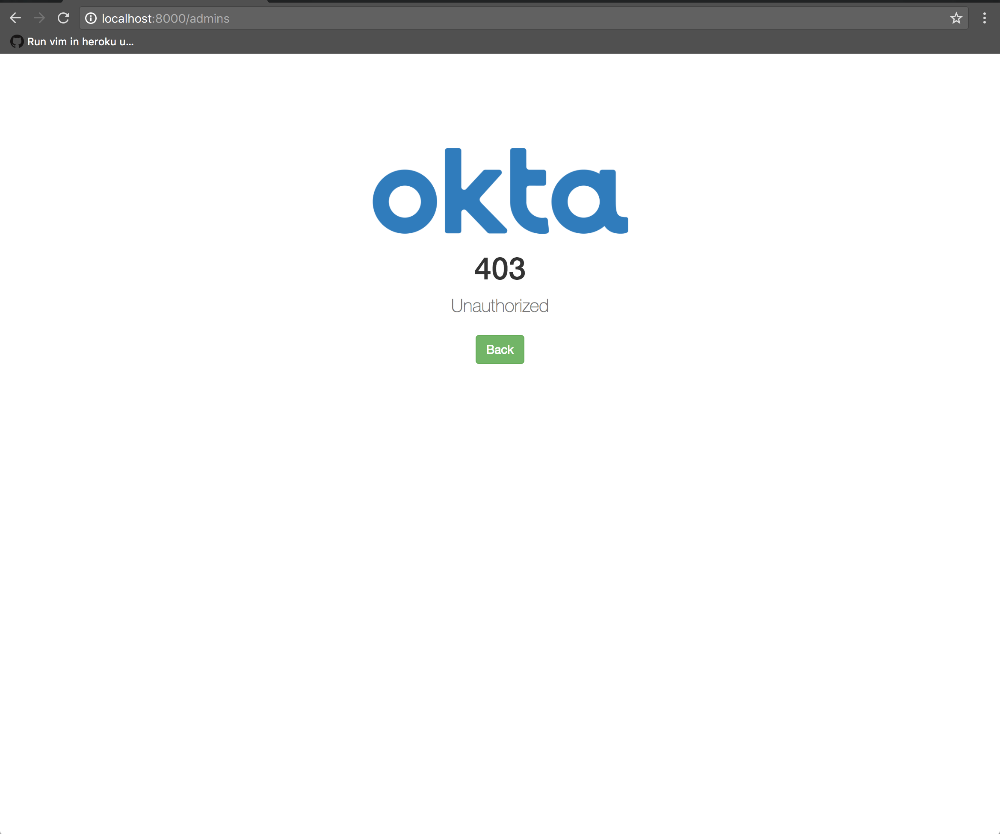

You should see a `403` Unauthorized message, since this user does not belong to the `admins` group.

Now, login as the admin user you setup before.

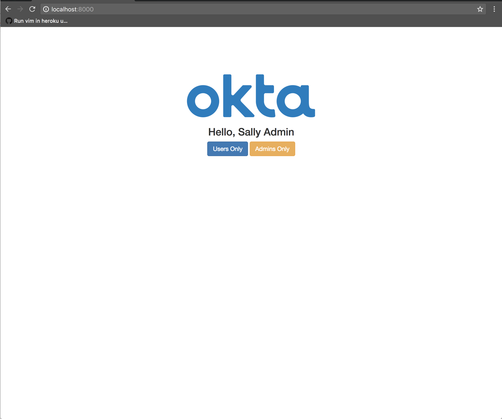

This time, when you click on `Admins Only`, you should see the page since this user belongs to the `admins` group.

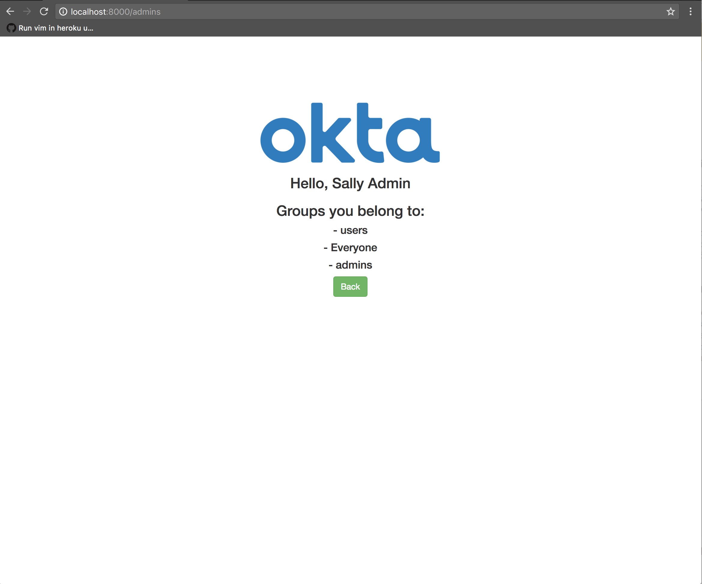